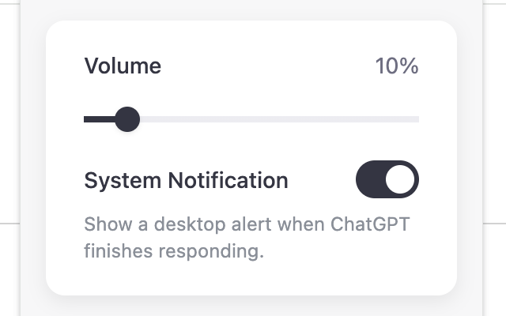

# ChatGPT Notifier

A Chrome extension that notifies you when ChatGPT has finished processing your request.

Plays a notification sound and can show a system notification when ChatGPT has finished responding.

当 ChatGPT 回复完成时，会播放提示音，并可显示系统通知。

當 ChatGPT 回覆完成時，會播放提示音，並可顯示系統通知。

ChatGPT の応答が完了すると通知音を再生し、システム通知を表示できます。

ChatGPT의 응답이 완료되면 알림음을 재생하고 시스템 알림을 표시할 수 있습니다.

## Install

[ChatGPT Notifier on Chrome Web Store](https://chromewebstore.google.com/detail/chatgpt-notifier/mliheodfanlkjlbgifdfnfmilemchoeg)
